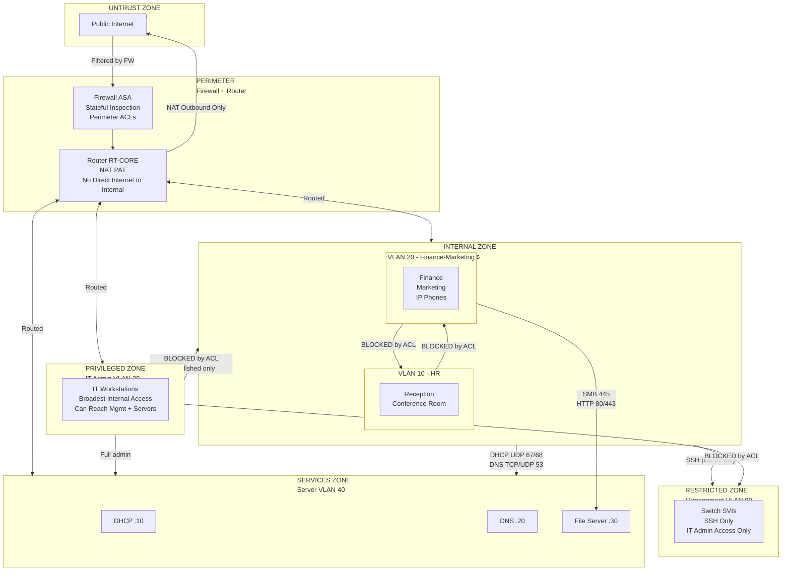
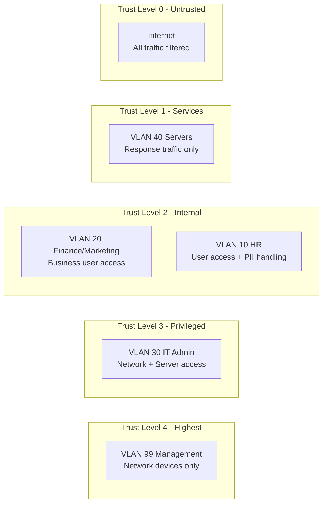

# Security Zones & Boundaries

## Zone Map

---

## Access Matrix

The table below shows which source zones can reach which destination zones.  
✅ = Permitted | ❌ = Denied | ⚠️ = Partially permitted (specific ports/services only)

| Source \ Destination | Internet | VLAN 10 HR | VLAN 20 Finance | VLAN 30 IT | VLAN 40 Servers | VLAN 99 Mgmt |
|---|---|---|---|---|---|---|
| **Internet** | — | ❌ | ❌ | ❌ | ❌ | ❌ |
| **VLAN 10 HR** | ✅ (NAT) | — | ❌ | ❌ | ⚠️ DHCP+DNS only | ❌ |
| **VLAN 20 Finance** | ✅ (NAT) | ❌ | — | ❌ | ⚠️ DHCP+DNS+SMB+HTTP | ❌ |
| **VLAN 30 IT** | ✅ (NAT) | ⚠️ Established only | ⚠️ Established only | — | ✅ Full | ⚠️ SSH only |
| **VLAN 40 Servers** | ✅ (NAT) | ⚠️ DHCP responses | ⚠️ DHCP+DNS+established | ⚠️ DHCP responses | — | ❌ |
| **VLAN 99 Mgmt** | ✅ (NAT) | ❌ | ❌ | ✅ | ❌ | — |

---

## Trust Levels

Higher trust can initiate connections to equal or lower trust (with ACL permits).  
Lower trust cannot initiate connections to higher trust zones.  
This is the core segmentation principle — enforce at the distribution layer ACLs.

---

## Threat Model Mapping

| Threat Scenario | Control in Place | Gap |
|---|---|---|
| External attacker → internal network | Firewall perimeter | Firewall sim is limited in Packet Tracer |
| Phishing on HR PC → Finance data | ACL: VLAN 10 → VLAN 20 denied | Intra-VLAN not controlled |
| Compromised Finance PC → IT Admin | ACL: VLAN 20 → VLAN 30 denied | — |
| Lateral movement via Management VLAN | ACL: non-IT VLANs → VLAN 99 denied | VTY also has access-class |
| Rogue DHCP server on user VLAN | Not mitigated | DHCP snooping not configured |
| Visitor device in conference room | Partial — on VLAN 10 with HR | Should be Guest VLAN |
| Compromised server → management | ACL: VLAN 40 → VLAN 99 denied | — |
| VLAN hopping attack | Native VLAN = 99, trunk pruning | Not fully hardened |
