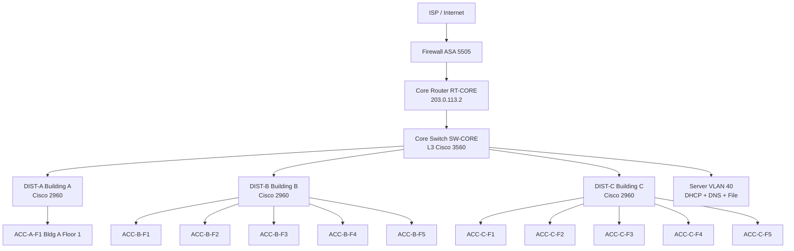
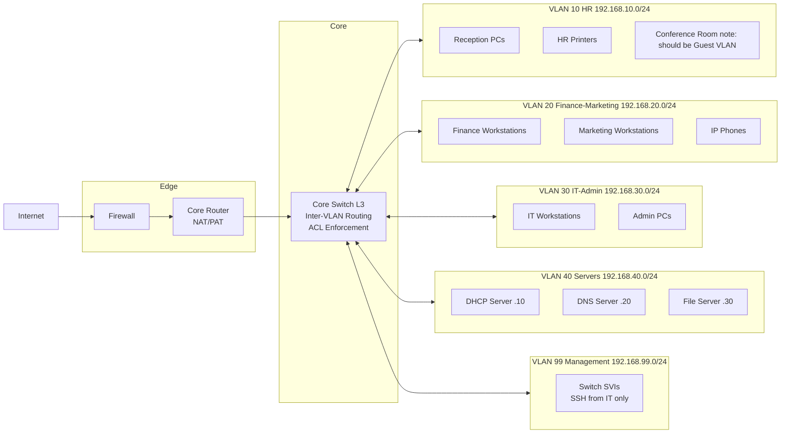
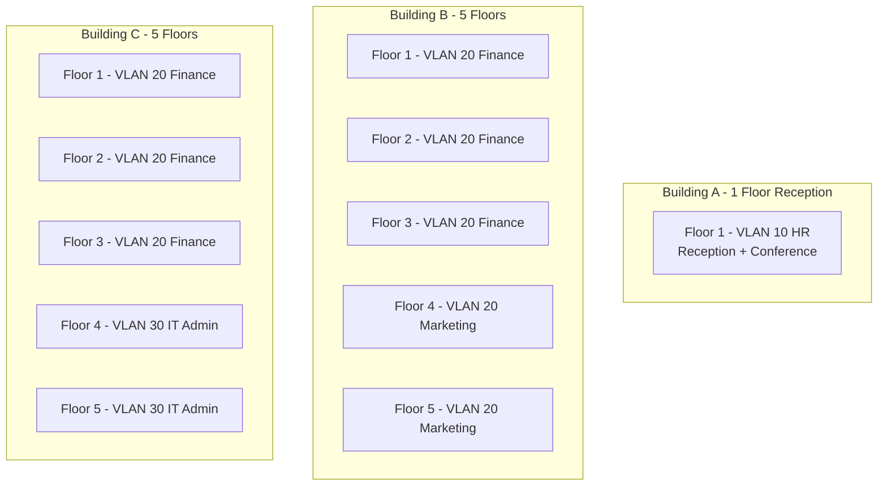
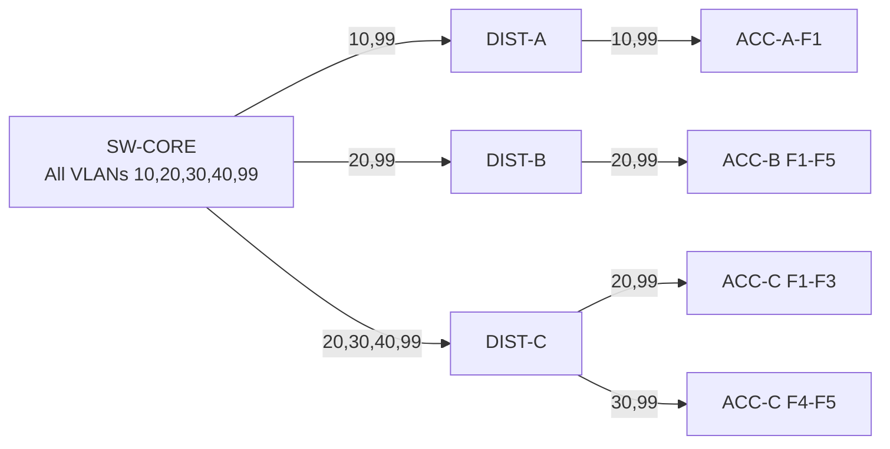

# Network Topology Diagrams

> **Note:** These Mermaid diagrams render on GitHub. Lucidchart versions with full visual detail are maintained separately. The Mermaid versions capture logical relationships and are useful for quick reference in code review/documentation contexts.

---

## Physical Topology

---

## Logical Topology (VLAN View)

---

## Building to VLAN Mapping

---

## Trunk VLAN Pruning

Trunk pruning: each trunk only carries VLANs needed downstream.
Building B distribution switch never carries VLAN 30 or 10 — no devices of those types are connected there.
