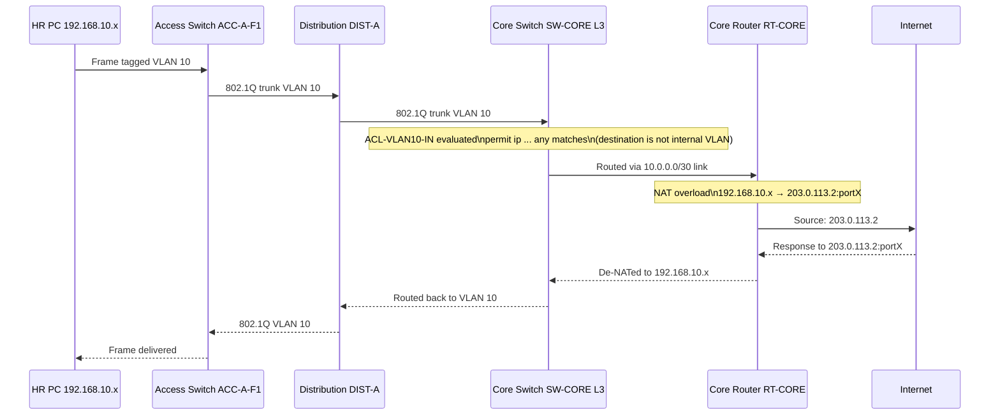
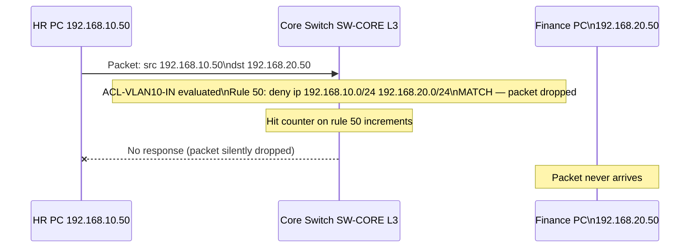
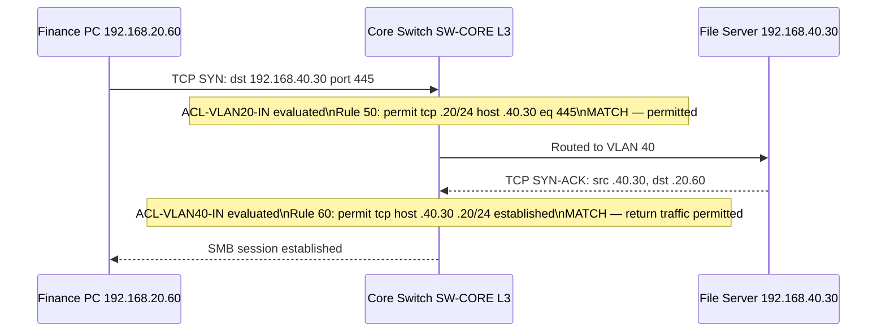
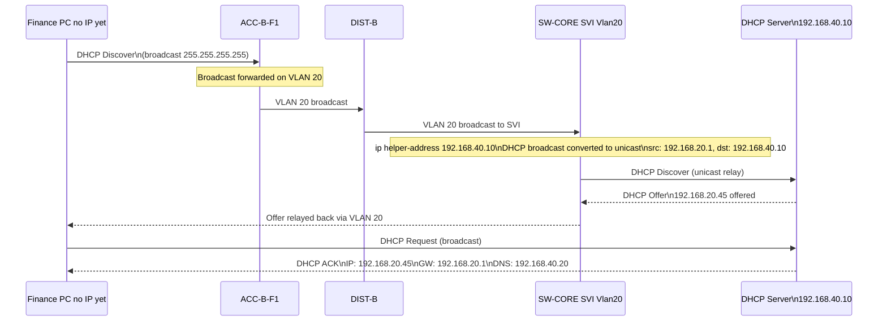
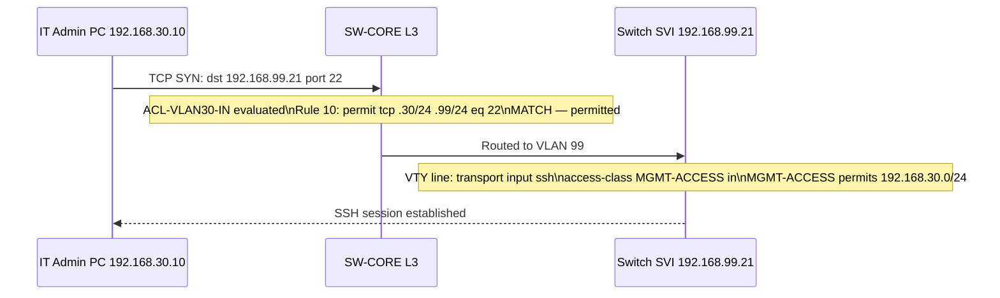
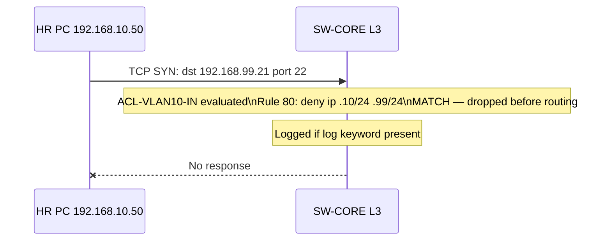

# Traffic Flow Diagrams

## HR Workstation → Internet

---

## HR PC → Finance PC (Should Be Blocked)

---

## Finance PC → File Server (Should Work)

---

## DHCP Discovery Flow (Client → Centralized Server)

---

## IT Admin → Management VLAN (SSH to Switch)

---

## HR PC Attempting to SSH Management VLAN (Should Fail)

